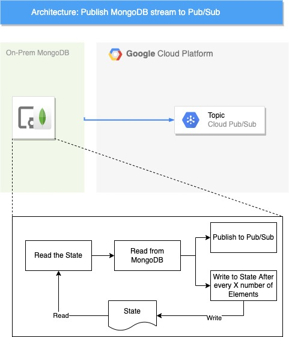

## Reading MongoDB changes and publishing to the Pub/Sub

Change streams allow applications to access data changes without the complexity and risk of tailing the oplog. The program helps to read the changes and then publish the change to Pub/Sub. We read the changes from the mongodb and publish the changes in Pub/Sub. Supervisor is used for process control. 

Install dependencies (`src/requirements.txt`) and `pip3 install -r src/requirements.txt`
Please pass the following parameters
- `project_id` Project Id for the 
- `topic` Topic where the changes are pushed
- `mongodb` MongoDB host (Comma seperated hostname)
- `port` MongoDB port
- `collection` The name of the collection which changes
- `threshold` Number of elements after which the state is persisted on the disk (state file is in the same path where python source is located. Name of state file `state_{name_of_collection}_cdc`)

 Set the service account key path to `GOOGLE_APPLICATION_CREDENTIALS` in supervisor configuration. Similarly set the other varaibles (`<<replace_me>>`) in `config/supervisord.config`

